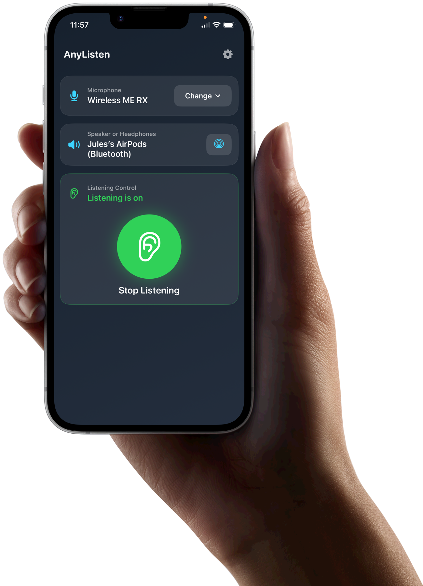
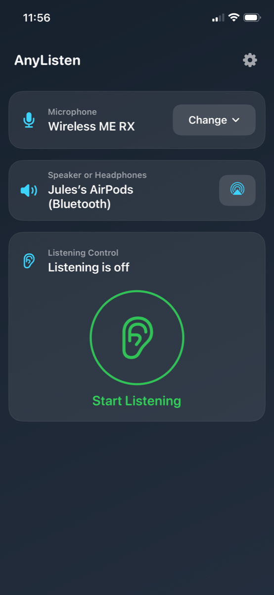
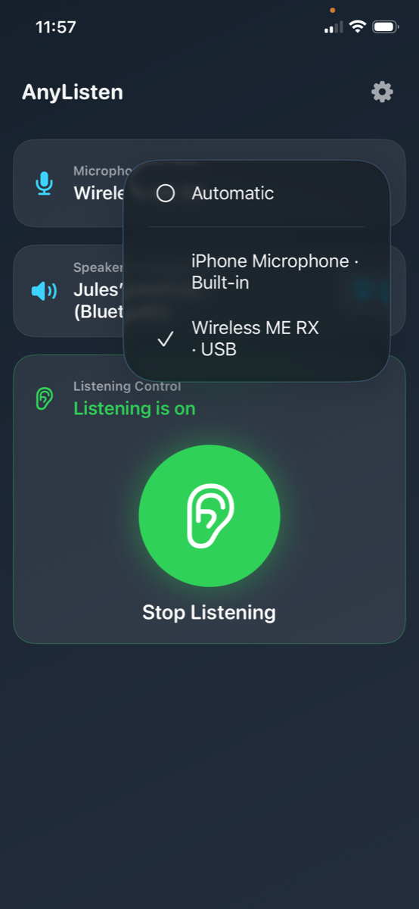
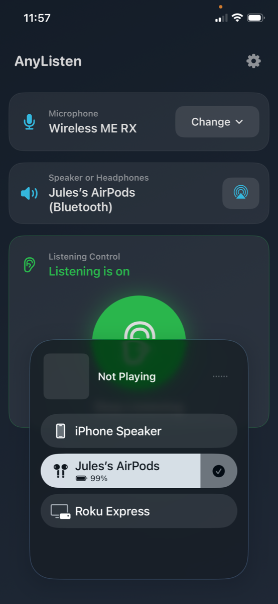
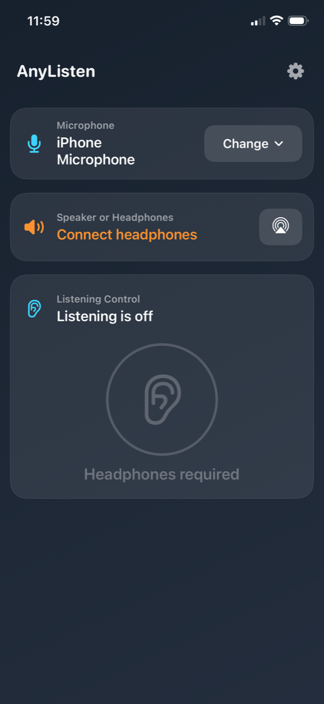
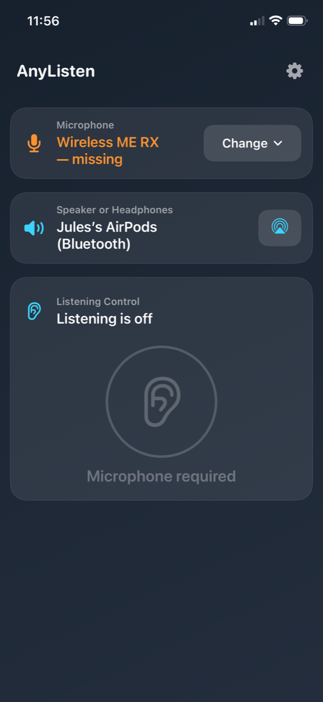
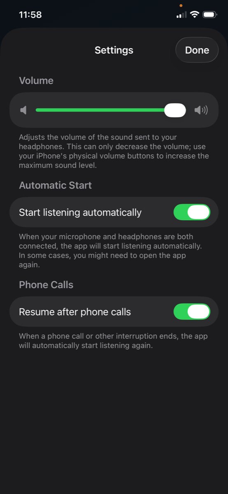

# AnyListen

<p align="center">
  
</p>

AnyListen is a small iOS app (iPhone & iPad) that routes a live microphone —
the built-in mic, a USB interface like a RØDE Wireless ME receiver, a headset,
or Bluetooth — straight to your headphones, hearing aids, or another audio
output, in real time. Think of it as Live Listen with any microphone and any
output you choose.

> All audio stays on-device. The app never records to disk, never uses the
> network, and contains no analytics or tracking. See
> [`AnyListen/PrivacyInfo.xcprivacy`](AnyListen/PrivacyInfo.xcprivacy),
> the [privacy policy](docs/privacy.html) and the
> [support page](docs/support.html) (both served via GitHub Pages).

## What it does

- **Live pass-through at Live-Listen-level latency.** The engine connects its
  input node directly to the main mixer — no tap, no player node — so
  app-added latency is essentially one ~5 ms I/O buffer. Verified on-device
  side-by-side with Apple's Live Listen (no audible echo).
- **Input picker with Automatic mode.** Pick a specific input, or leave it on
  Automatic and the app prefers external mics (USB, headset) over the built-in
  mic. Your selection persists across launches, and a late-enumerating USB
  device self-heals within a few seconds of launch.
- **Output via the system route picker.** AirPods, Bluetooth hearing aids or
  speakers, USB audio, AirPlay — whatever iOS offers. If your headphones
  disconnect mid-session, the app says so ("Jules's AirPods — missing")
  instead of pretending nothing happened.
- **Speaker route = blocked.** Listening requires headphones (or another
  external output) — full stop. Whenever the iPhone speaker is the selected
  output, the Listen button stays disabled and the app says "Connect
  headphones", whether you have no headphones connected or simply picked
  the speaker in the picker yourself. No feedback screech, no false
  "missing" claims.
- **Settings** (gear icon): monitor volume (zero-added-latency gain on the
  mixer), start listening automatically when your gear is connected, and
  resume listening after a phone call or other interruption.
- **Background audio** keeps the loopback running with the screen off or the
  app backgrounded.
- **Full state recovery:** route changes, unplugged devices, phone calls, and
  media-services resets are all handled with a clean stop and a clear
  explanation — never a stuck "listening" button.

## Screenshots

| Ready to listen | Pick an input | Pick an output |
|---|---|---|
|  |  |  |

| Headphones required | Mic went missing | Settings |
|---|---|---|
|  |  |  |

Full-resolution captures (1170 × 2532) live in [`screenshots/`](screenshots/);
`iphone-frame.png` is the mockup frame used for the hero image above.

## High-level architecture

SwiftUI views drive a single `ObservableObject` — `AudioEngineManager` — which
owns an `AVAudioEngine` and an `AVAudioSession`. The engine's input node is
connected *directly* to its main mixer node, producing a real-time loopback to
the user's chosen output at roughly one I/O buffer (~5 ms) of app-added
latency — no tap, no player node, no scheduling jitter. This matches Live
Listen's latency, which is a hard requirement (see
[`docs/ROADMAP.md`](docs/ROADMAP.md)).

Output selection is owned by iOS through `AVRoutePickerView`; the app never
re-activates the session while it's alive, so the user's route choice survives
stop/start. See [`docs/ARCHITECTURE.md`](docs/ARCHITECTURE.md) and
[`docs/AUDIO_PIPELINE.md`](docs/AUDIO_PIPELINE.md) for the full picture,
including why Bluetooth HFP is opt-in only (so AirPods can't hijack a USB
input).

## Project layout

```
AnyListen/
├── AnyListenApp.swift          # @main entry point
├── AudioEngineManager.swift    # Core audio / AVAudioSession logic
├── AudioRoutePicker.swift      # SwiftUI wrapper around AVRoutePickerView
├── ContentView.swift           # The single screen + Settings sheet
├── Localizable.xcstrings       # String catalog (source: English)
├── InfoPlist.xcstrings         # Localizable Info.plist strings
├── PrivacyInfo.xcprivacy       # Privacy manifest (no data collection)
├── Assets.xcassets/            # App icon
└── Info.plist                  # Generated by XcodeGen — don't hand-edit
```

## Building

The project is generated from [`project.yml`](project.yml) via
[XcodeGen](https://github.com/yonaskolb/XcodeGen):

```sh
brew install xcodegen
xcodegen generate
open AnyListen.xcodeproj
```

Requires Xcode 15+; deployment target is iOS 17.0 (set explicitly in
`project.yml`). See [`docs/DEVELOPMENT.md`](docs/DEVELOPMENT.md) for signing
and regeneration notes.

## App Store readiness

- ✅ App icon (1024×1024) in `Assets.xcassets` — **opaque RGB, no alpha
  channel or rounded corners** (App Store ITMS-90717 rules), wired into
  the generated project (`ASSETCATALOG_COMPILER_APPICON_NAME`). Source
  layers for a future Icon Composer (Liquid Glass) variant live in
  [`design/icon/`](design/icon/).
- ✅ Privacy manifest declaring no collected data, no tracking, and the
  UserDefaults required-reason API usage.
- ✅ Privacy policy + support pages in `docs/` (`privacy.html`,
  `support.html`), linked in-app from the Settings sheet and entered as
  the App Store Connect privacy/support URLs.
- ✅ Microphone-denied state has a dedicated card with an "Open
  Settings" remediation path; all other stop causes stay in-place
  (orange state text + disabled-button reason) by design.
- ✅ Dynamic Type: all text scales (`@ScaledMetric`), controls keep ≥44pt
  targets; VoiceOver labels/hints/announcements throughout.
- ✅ All user-facing strings extracted into `Localizable.xcstrings` /
  `InfoPlist.xcstrings` — the app ships English-only for v1, but adding a
  language is now a data-only change in the catalogs.
- ✅ iPhone + iPad (`TARGETED_DEVICE_FAMILY: "1,2"`), portrait-only with
  `UIRequiresFullScreen` (stopgap — see "Deferred: iPad landscape" in
  [`docs/ROADMAP.md`](docs/ROADMAP.md)).
- ✅ `ITSAppUsesNonExemptEncryption = false` — no export-compliance
  question per submission.
- ❌ No test target yet (see [`docs/REVIEW.md`](docs/REVIEW.md) L3).

The App Store listing (store name, subtitle, search keywords, category) is
decided and recorded in [`docs/APP_STORE.md`](docs/APP_STORE.md). Those
fields live in App Store Connect, not in this repo — the on-device name
stays "AnyListen". A focused review of remaining gaps is in
[`docs/REVIEW.md`](docs/REVIEW.md); the doc index is
[`docs/README.md`](docs/README.md).
